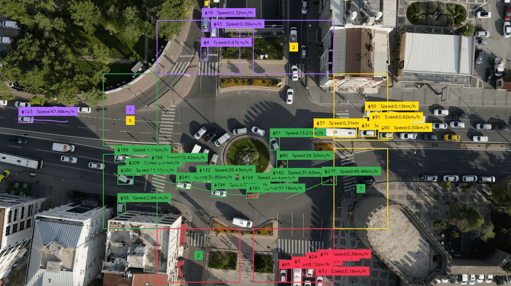

# Traffic Analysis using YOLOv8 and ByteTrack

This script analyzes traffic flow using YOLOv8 for object detection and ByteTrack for efficient online multi-object tracking. It includes:

1. **Vehicle Detection**: Detecting each vehicle at an intersection and drawing bounding boxes around them. The color of each bounding box corresponds to the side of the intersection from which the vehicle entered.
  
2. **Instantaneous Speed Estimation**: Estimating the speed of each detected vehicle every 10 frames and displaying it above the vehicle.
  
3. **Path Outlining**: Tracing the path of each vehicle over the last few seconds.
  
4. **Vehicles' direction Panel**: Depicting the number of cars from each side of the intersection that chose a particular exit.

<div align="center">

</div>
<br><br>

## How to Run
- **Clone the Repository**.

```bash
git clone https://github.com/Behnam-Asadi/YOLOv8-traffic-analysis.git
 ```
- **Install Required Dependencies.**

 ```bash
pip install -r requirements.txt
 ```
- **Download Files.**
 ```bash
./setup.sh
 ```
- **Run the Model.**
 ```bash
python ultralytics_example.py \
--source_weights_path data/traffic_analysis.pt \
--source_video_path data/traffic_analysis.mov \
--confidence_threshold 0.3 \
--iou_threshold 0.5 \
--target_video_path data/traffic_analysis_result.mov
 ```
